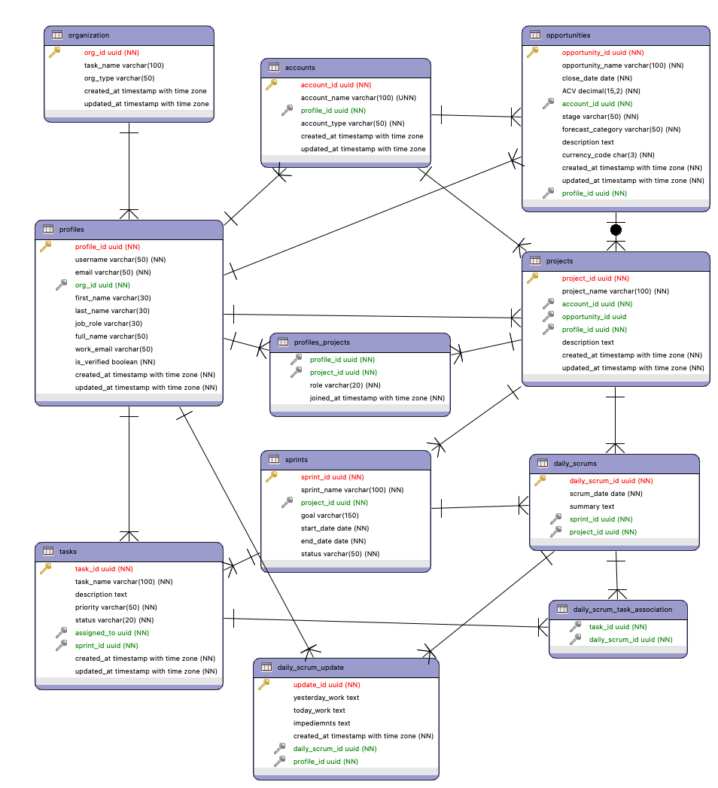

# 마이싱글 Backend API 서버 구축

## 1. 백엔드 API 서버 구축 계획

백엔드 API 서버를 성공적으로 구축하기 위해, 다음과 같은 단계로 진행할 수 있습니다. 각 단계별로 주요 활동을 제시하여 프로젝트가 체계적으로 진행될 수 있도록 돕습니다.

---

### **1단계: 프로젝트 초기 설정**

**주요 활동:**
- **환경 설정 및 초기 파일 생성:**
  - 프로젝트 디렉토리 구조 설정.
  - Python 가상환경 설정 및 필수 라이브러리 설치 (FastAPI, SQLModel, Uvicorn 등).
  - `.env` 파일을 생성하여 환경 변수 (데이터베이스 URL 등) 설정.
  - `requirements.txt` 파일 생성 및 초기 종속성 기록.
  
- **Git 설정 및 초기 커밋:**
  - Git 저장소 초기화 및 `.gitignore` 파일 생성.
  - 초기 프로젝트 설정을 커밋하여 버전 관리 시작.

---

### **2단계: 데이터베이스 모델링 및 마이그레이션**

**주요 활동:**
- **데이터베이스 연결 설정:**
  - `database.py` 파일에서 SQLModel을 사용해 데이터베이스 연결 설정.
  - Supabase PostgreSQL 데이터베이스와의 연결 테스트.

- **데이터베이스 모델 정의:**
  - `models.py` 파일에 프로젝트의 전체 스키마를 반영한 SQLModel 데이터베이스 모델 생성.
  - 각 테이블의 관계 (Foreign Keys) 및 제약 조건 설정.

- **초기 마이그레이션 실행:**
  - SQLModel을 사용하여 초기 데이터베이스 마이그레이션 실행.
  - 데이터베이스 테이블 생성 및 데이터베이스 구조 확인.

---

### **3단계: CRUD 기능 구현**

**주요 활동:**
- **CRUD 함수 구현:**
  - `crud.py` 파일에서 각 모델에 대해 기본적인 CRUD 함수(생성, 조회, 업데이트, 삭제) 구현.
  - 데이터베이스와의 상호작용을 위한 쿼리 최적화.

- **API 스키마 정의:**
  - `schemas.py` 파일에서 각 모델에 대한 Pydantic 기반의 데이터 검증 스키마 생성.
  - 입력 데이터와 출력 데이터의 구조를 명확하게 정의.

- **API 엔드포인트 구현:**
  - `api/` 디렉토리에 각 엔티티(예: accounts, profiles, projects)별로 FastAPI 라우터 생성.
  - 각 CRUD 기능을 수행하는 엔드포인트를 구현하고, 요청 및 응답 처리.

---

### **4단계: 트리거 및 비즈니스 로직 구현**

**주요 활동:**
- **트리거 함수 및 비즈니스 로직 구현:**
  - `triggers.sql` 파일에서 데이터베이스 트리거를 정의 (예: `full_name` 자동 생성).
  - FastAPI 내에서 비즈니스 로직을 구현할 경우, 관련 트리거 함수를 Python으로 구현.

- **API 동작 확인:**
  - 트리거가 적용된 데이터 생성 및 업데이트 시, 올바르게 동작하는지 테스트.

---

### **5단계: 인증 및 보안 설정**

**주요 활동:**
- **사용자 인증 및 권한 관리:**
  - `core/security.py` 파일에서 OAuth2, JWT 등을 사용한 사용자 인증 로직 구현.
  - 사용자 권한에 따라 접근 가능한 API 엔드포인트 제한.

- **환경 변수 및 보안 설정:**
  - `.env` 파일을 통해 보안 관련 설정 (비밀번호, API 키 등) 관리.
  - 배포 시 `.env` 파일을 안전하게 관리할 수 있도록 설정.

---

### **6단계: 테스트 및 문서화**

**주요 활동:**
- **자동화된 테스트 작성:**
  - `tests/` 디렉토리에서 유닛 테스트 및 통합 테스트 작성.
  - FastAPI의 `TestClient`를 사용해 API 엔드포인트 테스트.

- **Swagger 및 OpenAPI 문서화:**
  - FastAPI의 기본 기능을 활용하여 API 문서화.
  - 추가적인 설명과 예시를 통해 API 사용법을 문서화.

---

### **7단계: 배포 및 모니터링 설정**

**주요 활동:**
- **Docker를 이용한 컨테이너화:**
  - `Dockerfile`과 `docker-compose.yml`을 작성하여 프로젝트를 컨테이너화.
  - 개발 환경 및 배포 환경에서 일관된 실행 환경 제공.

- **배포 및 모니터링 설정:**
  - Supabase 및 기타 클라우드 플랫폼을 통해 서버 배포.
  - 로그 및 모니터링 툴 설정 (예: Prometheus, Grafana)하여 서버 상태를 모니터링.

---

### **8단계: 유지보수 및 기능 확장**

**주요 활동:**
- **기능 확장 및 최적화:**
  - 새로운 요구 사항에 따라 API 엔드포인트 추가 및 수정.
  - 데이터베이스 쿼리 최적화 및 API 성능 향상.

- **버전 관리 및 배포 자동화:**
  - GitHub Actions 등의 CI/CD 도구를 사용하여 배포 자동화.
  - 버전 관리를 통해 안정적인 배포 및 롤백 가능하도록 설정.

---

## 2. 프로젝트 ERD 및 Directory 구조


```plaintext
project-root/
├── app/                           # 애플리케이션 코드가 포함된 디렉토리
│   ├── api/                       # API 라우트와 관련된 코드가 위치
│   │   ├── v1/                    # API의 첫 번째 버전 디렉토리
│   │   │   ├── endpoints/         # API 엔드포인트 파일들이 위치한 디렉토리
│   │   │   │   ├── accounts.py    # 계정 관련 엔드포인트 정의
│   │   │   │   ├── profiles.py    # 프로필 관련 엔드포인트 정의
│   │   │   │   ├── projects.py    # 프로젝트 관련 엔드포인트 정의
│   │   │   │   └── ...            # 다른 엔드포인트 파일들
│   │   │   ├── __init__.py        # 패키지 초기화 파일
│   │   │   └── deps.py            # 공통 API 종속성 정의
│   │   ├── __init__.py            # 패키지 초기화 파일
│   ├── core/                      # 애플리케이션의 핵심 로직과 설정
│   │   ├── config.py              # 환경 설정 및 애플리케이션 설정 파일
│   │   ├── security.py            # 인증 및 권한 부여와 관련된 코드 파일
│   │   └── __init__.py            # 패키지 초기화 파일
│   ├── crud/                      # CRUD 관련 로직이 포함된 디렉토리
│   │   ├── accounts.py            # 계정 관련 CRUD 함수 정의
│   │   ├── profiles.py            # 프로필 관련 CRUD 함수 정의
│   │   ├── projects.py            # 프로젝트 관련 CRUD 함수 정의
│   │   └── __init__.py            # 패키지 초기화 파일
│   ├── db/                        # 데이터베이스 관련 코드
│   │   ├── base.py                # 모든 SQLModel 클래스가 상속받는 기본 모델 정의
│   │   ├── session.py             # 데이터베이스 세션 설정 코드
│   │   ├── init_db.py             # 초기 데이터베이스 초기화 코드
│   │   └── __init__.py            # 패키지 초기화 파일
│   ├── models/                    # SQLModel 데이터베이스 모델 정의
│   │   ├── account.py             # 계정 모델 정의
│   │   ├── profile.py             # 프로필 모델 정의
│   │   ├── project.py             # 프로젝트 모델 정의
│   │   ├── __init__.py            # 패키지 초기화 파일
│   ├── schemas/                   # 데이터 검증 및 직렬화를 위한 Pydantic 스키마 정의
│   │   ├── account.py             # 계정 관련 스키마 정의
│   │   ├── profile.py             # 프로필 관련 스키마 정의
│   │   ├── project.py             # 프로젝트 관련 스키마 정의
│   │   ├── __init__.py            # 패키지 초기화 파일
│   ├── main.py                    # FastAPI 애플리케이션의 진입점
│   ├── __init__.py                # 패키지 초기화 파일
├── tests/                         # 테스트 코드가 포함된 디렉토리
│   ├── test_accounts.py           # 계정 관련 테스트 파일
│   ├── test_profiles.py           # 프로필 관련 테스트 파일
│   ├── test_projects.py           # 프로젝트 관련 테스트 파일
│   ├── __init__.py                # 패키지 초기화 파일
├── alembic/                       # Alembic 데이터베이스 마이그레이션 관련 파일
│   ├── versions/                  # 마이그레이션 파일이 저장되는 디렉토리
│   ├── env.py                     # Alembic 환경 설정 파일
│   ├── script.py.mako             # Alembic 스크립트 템플릿
│   └── README                     # Alembic 사용법에 대한 설명 파일
├── docker/                        # Docker 관련 파일이 포함된 디렉토리
│   ├── Dockerfile                 # Docker 이미지 생성 파일
│   ├── docker-compose.yml         # Docker Compose 설정 파일
├── .env                           # 환경 변수를 정의하는 파일
├── .gitignore                     # Git에서 추적하지 않을 파일이나 디렉토리를 정의하는 파일
├── requirements.txt               # 프로젝트의 Python 패키지 종속성을 정의하는 파일
├── README.md                      # 프로젝트에 대한 설명 및 실행 방법을 기록한 파일
└── alembic.ini                    # Alembic 설정 파일
```
## 3. 단계별 구축

### 1 프로젝트 초기화 및 기본 설정

1. **프로젝트 구조 설정**:
    - 제공된 디렉토리 구조에 따라 프로젝트 디렉토리와 하위 디렉토리를 생성합니다.
        ```zsh
        mkdir -p app/{api,v1,core,crud,db/{migrations},models,schemas,tests} && \
        touch app/api/{account.py,daily_scrum.py,opportunity.py,project.py,sprint.py,task.py} && \
        touch app/core/{config.py,security.py} && \
        touch app/crud/{account.py,daily_scrum.py,opportunity.py,project.py,sprint.py,task.py} && \
        touch app/db/{session.py,init_db.py} && \
        touch app/models/{account.py,daily_scrum.py,opportunity.py,project.py,sprint.py,task.py} && \
        touch app/schemas/{account.py,daily_scrum.py,opportunity.py,project.py,sprint.py,task.py} && \
        touch app/tests/{test_account.py,test_daily_scrum.py,test_opportunity.py,test_project.py,test_sprint.py,test_task.py} && \
        touch app/main.pyRA
        ```

2. **가상 환경 설정 및 패키지 설치**:
    - Python 가상 환경을 생성하고 활성화합니다.
    - `pip`를 사용하여 `FastAPI`, `SQLModel`, `Alembic`, `Pydantic`, `uvicorn` 등의 필수 패키지를 설치합니다.
    
    ```bash
    python3 -m venv venv
    source venv/bin/activate
    pip install fastapi sqlmodel alembic uvicorn pydantic
    ```

3. **프로젝트 기본 설정 파일 작성**:
    - `app/core/config.py` 파일을 작성하여 프로젝트의 환경 변수 및 설정 값을 관리합니다.
    - `.env` 파일을 작성하여 데이터베이스 URL 등 민감한 정보를 환경 변수로 관리합니다.

    ```python
    # app/core/config.py
    from pydantic import BaseSettings

    class Settings(BaseSettings):
        DATABASE_URL: str

        class Config:
            env_file = ".env"

    settings = Settings()
    ```

4. **데이터베이스 연결 설정**:
    - `app/db/session.py` 파일을 작성하여 SQLModel을 사용해 데이터베이스 세션을 설정합니다.
    
    ```python
    # app/db/session.py
    from sqlmodel import SQLModel, create_engine, Session
    from app.core.config import settings

    engine = create_engine(settings.DATABASE_URL)

    def get_session():
        with Session(engine) as session:
            yield session
    ```

5. **모델 정의**:
    - `app/models/` 디렉토리에 각 테이블에 대한 SQLModel 모델을 정의합니다.
    
    ```python
    # app/models/account.py
    from sqlmodel import SQLModel, Field
    from typing import Optional
    from uuid import uuid4

    class Account(SQLModel, table=True):
        account_id: Optional[str] = Field(default_factory=lambda: str(uuid4()), primary_key=True)
        account_name: str
        profile_id: str
        account_type: Optional[str] = Field(default="Prospect")
        created_at: Optional[str] = Field(default_factory=lambda: str(uuid4()))
        updated_at: Optional[str] = Field(default_factory=lambda: str(uuid4()))
    ```

6. **데이터베이스 초기화 스크립트 작성**:
    - `app/db/init_db.py` 파일을 작성하여 데이터베이스 초기화 작업을 수행합니다.
    
    ```python
    # app/db/init_db.py
    from sqlmodel import SQLModel
    from app.db.session.py import engine
    from app.models.account import Account
    # 다른 모델 임포트
    
    def init_db():
        SQLModel.metadata.create_all(engine)
    ```

7. **FastAPI 애플리케이션 초기화**:
    - `app/main.py` 파일을 작성하여 FastAPI 애플리케이션의 진입점을 설정합니다.
    - 데이터베이스 초기화를 포함하여 기본적인 API 설정을 포함합니다.
    
    ```python
    # app/main.py
    from fastapi import FastAPI
    from app.db.init_db import init_db

    app = FastAPI()

    @app.on_event("startup")
    def on_startup():
        init_db()

    @app.get("/")
    def read_root():
        return {"message": "Hello World"}
    ```

8. **Alembic 설정**:
    - Alembic을 사용하여 데이터베이스 마이그레이션을 관리하기 위한 초기 설정을 수행합니다.
    - Alembic 설정 파일인 `alembic.ini`를 설정하고, `alembic` 디렉토리와 `env.py`를 설정합니다.

    ```bash
    alembic init alembic
    ```

9. **테스트 설정**:
    - `tests/` 디렉토리에 기본 테스트 구조를 설정하고, 테스트를 위한 초기 코드를 작성합니다.
    - 테스트 도구로 `pytest`를 사용할 수 있도록 설정합니다.

    ```bash
    pip install pytest
    ```


